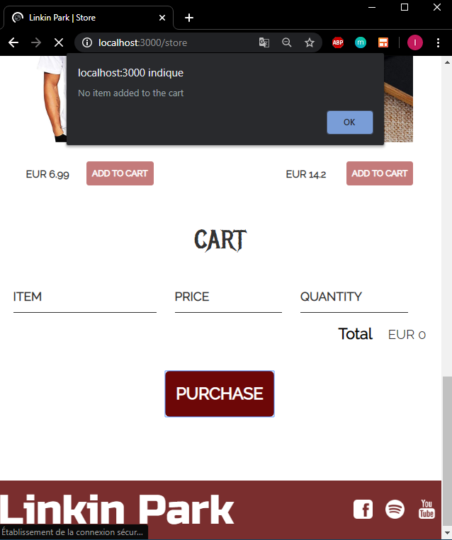
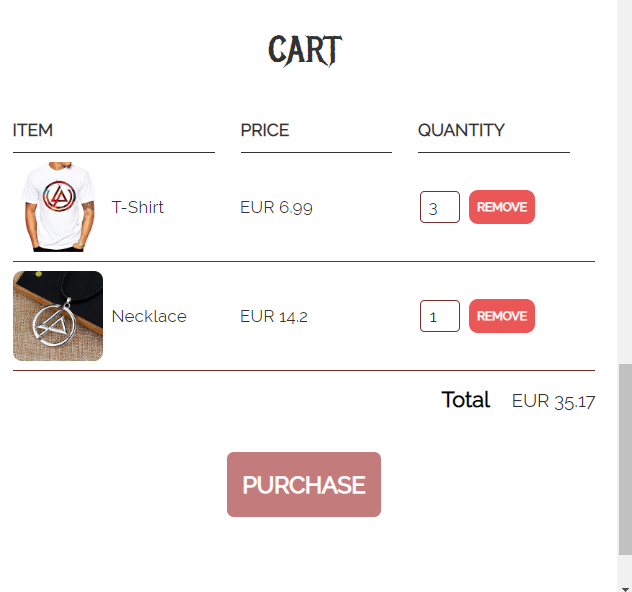
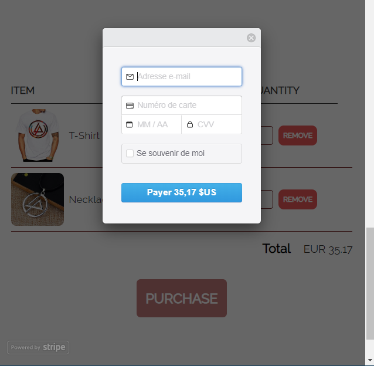
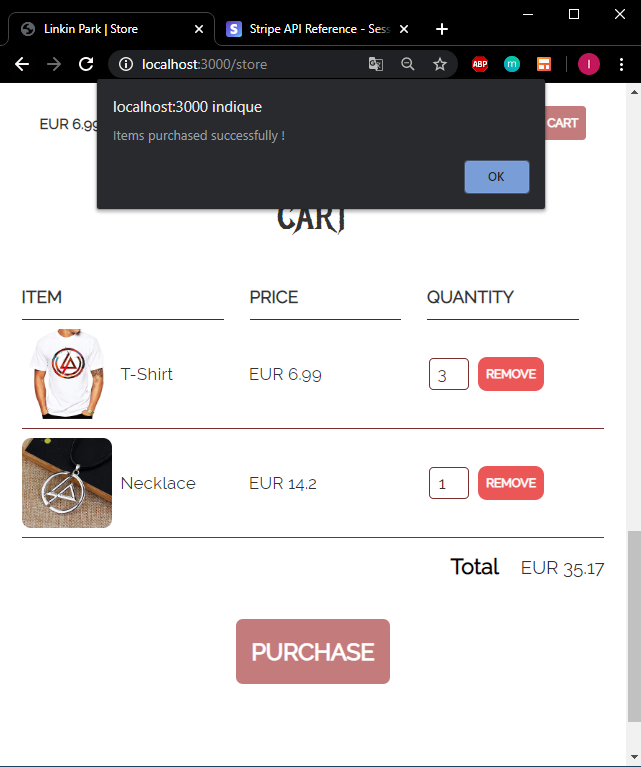
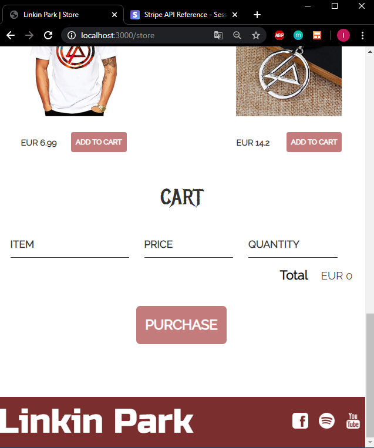
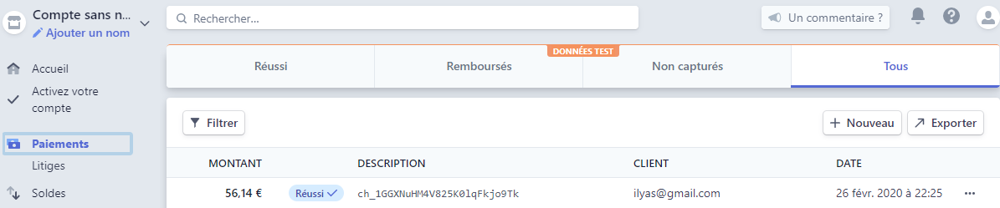

# Payments-With-Stripe
In this project , I managed to setup payments with Stripe API by implementing it on a project that I have already worked on it , the "LinkinPark" project that you can find in my repositories. I worked on a server based on Express , a NodeJS framework for web apps

## Stripe: 
Stripe is one of the best software plateform for online payment processing for internet businesses. Stripe is a suite of payment APIs that powers commerce for online businesses of all sizes.

The link to its documentation : https://stripe.com/docs

# Store Page

# Click on purchase while the cart is empty

# Choose items with quantities to purchase

# Click on purchase and fill card credentials. 
4242 4242 4242 4242 is The test code for Visa in Stripe.

# Finalization of payment

# Transactions done viewed in Stripe dashboard

